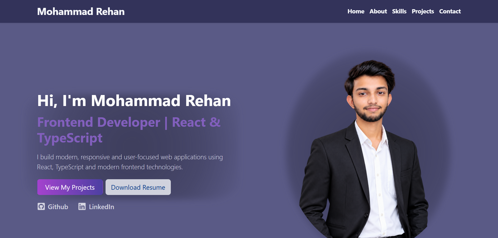

# Mohammad Rehan | Personal Portfolio

A modern and responsive personal portfolio website built to showcase my skills, projects, and frontend development journey.

## 🚀 Live Demo

[View Live Portfolio](https://01-personal-portfolio.vercel.app)

## ✨ Features

- Responsive and mobile-friendly design
- Modern dark-themed UI
- Hero section with resume download
- About Me section
- Skills section with technology categories
- Project showcase with screenshots
- Technology badges for projects
- Live Demo and GitHub links
- Contact form UI
- Smooth scrolling navigation
- SEO metadata and social sharing metadata
- Custom favicon

## 🛠️ Technologies Used

- React
- TypeScript
- Bootstrap
- CSS
- Vite
- React Icons
- Git & GitHub
- Vercel

## 📸 Preview



## ⚙️ Installation & Setup

Clone the repository:

```bash
git clone https://github.com/mdrehsn01/01-personal-portfolio.git